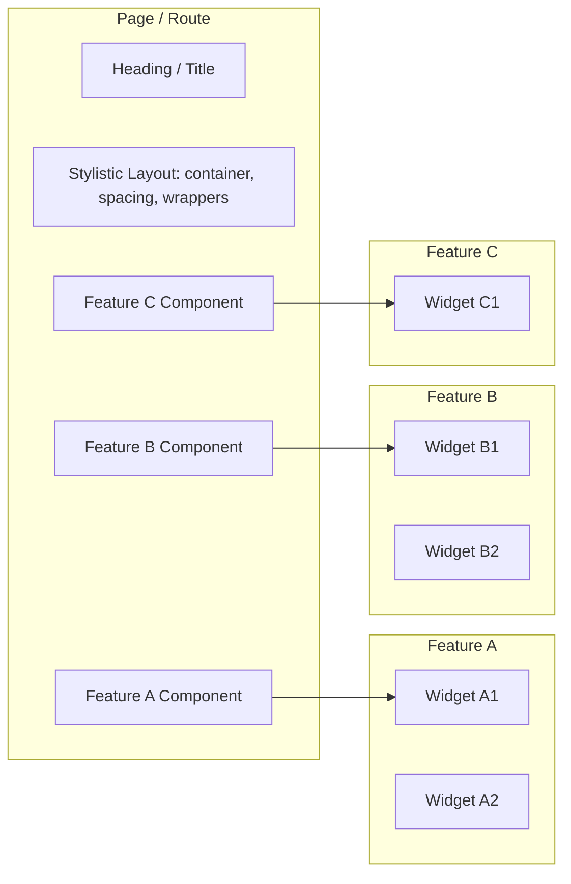

# Applifting Frontend Development Style Guide

**Table of contents**

- [Introduction](#introduction)
- [General Principles](#general-principles)
  - [Clean and Readable Code](#clean-and-readable-code)
  - [Reusability](#reusability)
  - [Separation of Concerns](#separation-of-concerns)
  - [Minimize Side Effects](#minimize-side-effects)
  - [Handle Errors with Feedback](#handle-errors-with-feedback)
- [Project Structure](#project-structure)
  - [Pages & Routes (Common Concepts)](#pages--routes-common-concepts)
  - [Next.js](#nextjs)
  - [TanStack Router (or React Router)](#tanstack-router-or-react-router)
  - [Cross-Feature Composition (Escape Hatch)](#cross-feature-composition-escape-hatch)
- [Naming Conventions](#naming-conventions)
  - [File naming](#file-naming)
  - [Variable naming](#variable-naming)
  - [Function naming](#function-naming)
  - [Good to Know](#good-to-know)
- [Components](#components)
  - [Example Component](#example-component)
  - [Code Order in Components](#code-order-in-components)
  - [Compound Component Pattern](#compound-component-pattern)
- [TypeScript](#typescript)
  - [Type vs Interface](#type-vs-interface)
  - [Utility Types](#utility-types)
  - [Immutability](#immutability)
  - [Enumerations](#enumerations)
- [Coding](#coding)
  - [Functions](#functions)
  - [Pure functions](#prefer-pure-functions)
  - [Boolean conversion](#boolean-conversion)
  - [Declarative vs Imperative](#declarative-vs-imperative)
- [Static Code Analysis](#static-code-analysis)
  - [ESLint](#eslint)
  - [Prettier](#prettier)
- [Documentation](#documentation)
  - [Inside Code](#inside-code)
- [Contribution](#contribution)
  - [Merge Requests](#merge-requests)
- [Environment Variables](#environment-variables)
- [Preferred Libraries](#preferred-libraries)
  - [UI Components](#ui-components)
    - [Typography](#typography)
  - [Styling](#styling)
    - [Tailwind CSS](#tailwind-css)
  - [Assets](#assets)
    - [Images](#images)
    - [SVGs](#svgs)
  - [Forms](#forms)
  - [Server State Management](#server-state-management)
    - [Tanstack Query](#tanstack-query)
  - [Routing](#routing)
  - [Translations](#translations)
    - [Adding Translation Documents](#adding-translation-documents)
    - [Using Translation in React Components](#using-translation-in-react-components)

## Introduction

This document provides clear instructions on how to write and structure React code to ensure a consistent developer experience across all projects. It aims to enhance maintainability, readability, and onboarding speed across all frontend codebases.

Think of this document as a handbook that you should refer to whenever you're unsure about how to name something, where to place it, or which library to choose. All developers should read it, and it's encouraged to revisit it from time to time.

> When a new project is started, it should comply with the current version of the style guide at that time.

This document follows [Semantic Versioning](https://semver.org/) and all changes are recorded in a [Changelog](CHANGELOG.md) based on [Keep a Changelog](https://keepachangelog.com/en/1.1.0/).

## General Principles

### Clean and Readable Code

**Code should be self-explanatory**. If a developer (including yourself) revisits the code months later, it should be easy to understand at a glance. Prefer clear, meaningful variable and function names over complex logic.

### Reusability

Follow the **DRY** (Don't Repeat Yourself) principle. Create reusable components and utilities whenever possible to avoid duplication and reduce maintenance.

### Separation of Concerns

Ensure that each part of the code has a **single responsibility** and is separated based on its concern (UI vs. logic vs. data fetching). This makes the code modular, easier to test, and simpler to refactor.

> Rule of thumb: A component or hook should rarely exceed 100 lines of code.

### Minimize Side Effects

Keep side effects isolated (e.g., in `useEffect`) and avoid logic in the render body. This helps maintain a pure and easy-to-follow component render flow.

Before using the `useEffect` hook, ask yourself: _Is this really a side effect?_ There's a great article, [You Might Not Need an Effect](https://react.dev/learn/you-might-not-need-an-effect), in the official React docs.

### Handle Errors with Feedback

Always handle potential errors gracefully, whether from API calls, state management, or user interaction. **Provide feedback to users** (e.g., error messages, toast notifications) and never let an error crash the app.

## Project Structure

React doesn’t impose a strict structure for files. After experimenting with various approaches, we’ve found **Feature-sliced Design** to offer the best experience. This pattern is well-documented in the [Bulletproof React](https://github.com/alan2207/bulletproof-react) repository, and we should follow its structure. Instead of copying its contents here, please refer to their documentation, especially the [Project Structure](https://github.com/alan2207/bulletproof-react/blob/master/docs/project-structure.md) section.

### Pages & Routes (Common Concepts)

These rules apply regardless of whether you’re using **Next.js** or **TanStack Router / React Router**:

- **Definition**  
  Define page (or route) components directly in their respective route files.
- **Composition**  
  Pages should compose **at least one feature component** (or multiple, if needed).
  - Pages are the place to bring **components from different features together** — that’s exactly their purpose.
- **Stylistic Layout**  
  Keep **headings, containers, spacing**, and other **purely stylistic layout elements** at the **page/route level.**
  - These do not belong inside features.
- **Page Heading**  
  The heading of a page should always live in the page/route component, never inside a feature.
- **Features**  
  Features should only provide **functional, reusable building blocks** (components, hooks, queries, etc.).
  - Think of feature components as widgets or sections that can be plugged into different pages.

> **Note 1**: The terms page and route mean the same thing — we usually say page in Next.js and route in React Router or TanStack Router.  
> **Note 2**: **File-based routing** is strongly preferred in both TanStack Router and React Router (just like in Next.js). It ensures consistent structure, discoverability, and reduces boilerplate.

#### Visual overview



### Next.js

All of the above applies, with the following additions:

- **App Router (Preferred)**  
  Use the `app/` directory for routing in new projects. Each route file under `app/` is a page, where you should apply the rules above (composition, headings, layout, etc.).
- **Pages Router (Legacy)**  
  The `pages/` directory can still be used in existing projects. Keep the standard structure, and remember:
  - Business logic for SSR/SSG (getServerSideProps, getStaticProps) must remain in the `pages/` directory, as it won’t work elsewhere.
- **Example Structure**:

```bash
src/
  app/
    posts/
      page.tsx                  # Page component that composes feature widgets
  features/
    posts/
      components/               # Posts-specific components
        PostList.tsx            # Posts list component
      hooks/                    # Posts-specific hooks
```

### TanStack Router (or React Router)

In TanStack Router (or React Router) applications, organize route files following the file-based routing pattern:

- **Routes Directory**  
  Create route files directly in the routes directory (e.g., `routes/_Layout/posts/index.tsx`).
- **Route Loaders**  
  Keep route-specific data fetching logic in the route file using `loader` functions.
- **Example Structure:**

  ```bash
  src/
    components/
      ui/
        Card.tsx            # Shared UI component
    app/                    # Application configuration
      Providers.tsx         # Global providers (RouterProvider, etc.)
      router.tsx            # TanStack Router configuration
      routes.ts             # Route constants and type definitions
    routes/
      __root.tsx            # Root route component
      _Layout.tsx           # Main layout route
      _Layout/              # Nested routes under main layout
        posts/
          index.tsx         # Route definition of posts feature with loader and component
        search/
          index.tsx         # Route definition of search feature with component
      login.tsx             # Login page route
    features/
      posts/
        api/                # Query keys and query options for posts API calls
        components/         # Posts-specific components
          PostList.tsx      # Posts list component
          PostListItem.tsx  # Posts list item component
        hooks/              # Posts-specific hooks
      search/
        api/                # Query keys and query options for search API calls
        components/         # Search-specific components
          SearchList.tsx    # Search list component
        hooks/              # Search-specific hooks
    lib/
      PostListItemContext.tsx
  ```

- **Example Route**:

  ```tsx
  // routes/_Layout/posts.tsx

  export const Route = createFileRoute("/_Layout/posts")({
    component: PostPage,
    loader: ({ context: { queryClient } }) => {
      void queryClient.prefetchQuery(postListQueryOptions());
    },
  });

  function PostPage() {
    const { t } = useTranslation("posts");

    return (
      <Card>
        <Card.Header>
          <Typography type="display-4xl">{t("title")}</Typography>
        </Card.Header>
        <Card.Content>
          <PostList />
        </Card.Content>
      </Card>
    );
  }
  ```

### Cross-Feature Composition (Escape Hatch)

This pattern lets a **page/route** inject a component from one feature into another (e.g., `PostsListItem` from **Posts** into **Search**).

**⚠️ Use only as a last resort.** Normally, features must not import from each other (enforced by ESLint). Pages are the only place where cross-feature wiring can happen. This avoids moving half-baked components into `src/` (shared) unnecessarily.

**Checklist before using:**

- [ ] A simple **prop/slot** API won’t work
- [ ] Context is provided at the **page/route** level, not globally
- [ ] The **contract is minimal and typed** (no leaking feature internals)
- [ ] There’s a clear **comment why** this escape hatch is needed

**Safer alternatives (if possible):**

- Pass a render function (`itemRenderer`) as a prop
- Define a tiny **contract type** in `src/` (shared) and keep implementations in features

```tsx
// src/routes/_Layout/search.tsx
import { SearchList } from "@/features/search/components/SearchList";
import { PostsListItem } from "@/features/posts/components/PostsListItem";
import { PostListItemProvider } from "@/lib/PostListItemContext";

export const Route = createFileRoute("/_Layout/search")({
  component: SearchPage,
});

function SearchPage() {
  const { t } = useTranslation("search");
  return (
    <Card>
      <Card.Header>
        <Typography type="display-4xl">{t("title")}</Typography>
      </Card.Header>
      <Card.Content>
        <PostListItemProvider postsListItem={PostsListItem}>
          <SearchList />
        </PostListItemProvider>
      </Card.Content>
    </Card>
  );
}

// src/features/search/SearchList.tsx
export const SearchList = () => {
  const { t } = useTranslation("search");
  const PostsListItem = usePostListItem();
  const { data } = useSuspenseQuery(searchQueryOptions());

  return (
    <>
      {!!data.items.length ? (
        <ul className="divide-y-1">
          {data.items.map((post) => (
            <PostsListItem key={post.id} post={post} />
          ))}
        </ul>
      ) : (
        <Typography className="text-muted-foreground">
          {t("noResultsMessage")}
        </Typography>
      )}
    </>
  );
};

// src/features/posts/providers/PostListItemContext.tsx
type PostListItemProps = {
  post: PostType;
};

type PostListItem = (props: PostListItemProps) => React.ReactNode;

type PostListItemContextValue = {
  postListItem: PostListItem;
};

const PostListItemContext = createContext<PostListItemContextValue>(
  undefined as never,
);

type PostListItemProviderProps = {
  postListItem: PostListItem;
  children: ReactNode;
};

export const PostListItemProvider = ({
  postListItem,
  children,
}: PostListItemProviderProps) => {
  return (
    <PostListItemContext.Provider value={{ postListItem }}>
      {children}
    </PostListItemContext.Provider>
  );
};

export const usePostListItem = () => {
  const context = useContext(PostListItemContext);
  if (!context) {
    throw new Error(
      '"usePostListItem" must be used within "PostListItemProvider"',
    );
  }
  return context;
};
```

## Naming Conventions

### File naming

| Category                                    | Naming Style | Example           |
| ------------------------------------------- | ------------ | ----------------- |
| Components                                  | PascalCase   | `MyComponent.tsx` |
| Hooks                                       | camelCase    | `useMyHook.ts`    |
| Folders                                     | camelCase    | `myFolder/`       |
| Contextual Collection of Components Folders | PascalCase   | `Sidebar/`        |
| Everything else                             | camelCase    | `myFile.ts`       |

### Variable naming

| Category                    | Naming Style                                        | Example                                 |
| --------------------------- | --------------------------------------------------- | --------------------------------------- |
| Constants (primitives)      | SCREAMING_SNAKE_CASE                                | `MY_CONSTANT`                           |
| Types                       | PascalCase                                          | `MyType`                                |
| Components                  | PascalCase                                          | `MyComponent`                           |
| Everything else             | camelCase                                           | `myVariable`                            |
| Keys in `json` files (i18n) | PascalCase (for objects) and camelCase (for values) | `Dashboard.Header.Navigation.userLabel` |

#### Boolean variables

All **boolean** variables should be named with a "_booleanish_" prefix, like `is`, `has`, `can`, `will`, `should`, `did`, etc.

- **Correct:** `isLoading` ✅
- **Incorrect:** `loading` ❌

### Function naming

_Borrowed from [kettanaito's naming cheatsheet](https://github.com/kettanaito/naming-cheatsheet)_ and slightly enhanced.

- Use the **A/HC/LC** pattern

```
prefix? + action (A) + high context (HC) + low context? (LC)
```

| Name                   | Prefix   | Action (A) | High context (HC) | Low context (LC) |
| ---------------------- | -------- | ---------- | ----------------- | ---------------- |
| `getUser`              |          | `get`      | `User`            |                  |
| `getUserMessages`      |          | `get`      | `User`            | `Messages`       |
| `handleClickOutside`   |          | `handle`   | `Click`           | `Outside`        |
| `shouldDisplayMessage` | `should` | `Display`  | `Message`         |                  |

#### Common actions

| Action      | Usage                                                                                                               |
| ----------- | ------------------------------------------------------------------------------------------------------------------- |
| `get`       | Accesses data immediately (i.e. shorthand getter of internal data). Or async data - get a resource from the server. |
| `set`       | Set a variable or state to a new value.                                                                             |
| `reset`     | Sets a variable back to its initial value or state.                                                                 |
| `remove`    | Removes something _from_ somewhere. E.g. remove a filter from a collection of selected filters. (_opposite of add_) |
| `delete`    | Erase something. E.g. delete resource from a database. (_opposite of create_)                                       |
| `compose`   | Combine multiple functions or elements into one.                                                                    |
| `handle`    | Respond to an event or trigger, typically prefixed for event callbacks (e.g. `handleClick`).                        |
| `add`       | Include something in a collection or group.                                                                         |
| `create`    | Make a new resource, object, or data structure.                                                                     |
| `format`    | Convert data into a specific or human-readable format.                                                              |
| `update`    | Change an existing value, state, or record with new information.                                                    |
| `init`      | Perform initial setup or bootstrapping.                                                                             |
| `toggle`    | Flip between two states, usually boolean (e.g. show/hide, true/false).                                              |
| `validate`  | Ensure data meets required rules or structure.                                                                      |
| `transform` | Convert data from one shape, structure, or format to another.                                                       |
| `cancel`    | Abort an operation or undo a pending action.                                                                        |

### Good to Know

- **Constants** include enumerations in the form of string literal union types, such as `type Color = "RED" | "BLUE"`.
- Don’t prefix types with `T` (e.g., `TUser`) unless there’s a naming conflict.
- When working with [zod](https://zod.dev) schemas, use the same name for the inferred type as the schema. For example, if the schema is named `userSchema`, the inferred type should be `UserSchema`.

## Components

- Define **props** above the component definition.
- Use **type** for **props** definition, not interface (more details in the [TypeScript](#typescript) section).
- Destructure **props**.
- Avoid using **explicit types** (_FC_ or _React.FC_) for component definitions. For more details, [read this article](https://react-typescript-cheatsheet.netlify.app/docs/basic/getting-started/function_components/).
- Use arrow functions for component definitions. See the [Coding](#coding) section.
  - unless you need hoisting (e.g. Tanstack router `Route.component` definition). In that case we need to use function declaration.

### Example Component

```tsx
type Props = {
  foo: string;
};

export const Component = ({ foo }: Props) => {
  return <div>Component {foo}</div>;
};
```

### Code Order in Components

Maintain a consistent flow within components. Whenever possible, follow this order:

1. Internal state (`useState`, `useReducer`, `useSearchParams`, etc.)
2. Derived state
3. Handler functions
4. Side effects (`useEffect`)

### Compound Component Pattern

Compound components are a good React pattern because they **share state implicitly between a parent and its children**, removing the need to pass down lots of props. This makes the API **more flexible and declarative**, since consumers can compose the UI by nesting child components naturally. A big advantage is that you can **omit any child component you don’t need**, keeping the usage **clean, intuitive, and scalable**.

[Example of **Popover compound component** definition](https://git.applifting.cz/frontend/fe-monorepo/-/blob/main/packages/ui/src/components/popover.tsx)

```tsx
// Usage
export const PopoverDemo = () => (
  <Popover>
    <Popover.Trigger asChild>
      <Button variant="outline">Open popover</Button>
    </Popover.Trigger>
    <Popover.Content className="w-80">
      <p>Content goes here</p>
    </Popover.Content>
  </Popover>
);
```

## TypeScript

> Always aim for the highest type safety. Never use the `any` type.

### Type vs Interface

> We should always default to `type` unless there's a valid use case for choosing `interface`.

There's a really good article [Type vs Interface: Which Should You Use?](https://www.totaltypescript.com/type-vs-interface-which-should-you-use) by Matt Pocock that goes in-depth on this topic.

**In summary**:

- **Interfaces can't express** unions, mapped types, or conditional types, and all of these are very useful in day-to-day frontend work.
- **Interfaces** with the same name in the same scope **merge their declarations**, leading to unexpected bugs.
- **Type** aliases have an implicit index signature of `Record<PropertyKey, unknown>`, which occasionally comes up.

- Basically, the **only pro of using interface** over type is inheritance. `extends` makes **TypeScript's type checker run slightly faster** than using `&`.

### Utility Types

Leverage TypeScript's [Utility Types](https://www.typescriptlang.org/docs/handbook/utility-types.html) instead of defining new types from scratch. These are particularly useful for frontend developers:

- [`Pick<Type, Keys>`](https://www.typescriptlang.org/docs/handbook/utility-types.html#picktype-keys)
- [`Omit<Type, Keys>`](https://www.typescriptlang.org/docs/handbook/utility-types.html#omittype-keys)
- [`Exclude<UnionType, ExcludedMembers>`](https://www.typescriptlang.org/docs/handbook/utility-types.html#excludeuniontype-excludedmembers)
- [`Extract<Type, Union>`](https://www.typescriptlang.org/docs/handbook/utility-types.html#extracttype-union)
- [`ReturnType<Type>`](https://www.typescriptlang.org/docs/handbook/utility-types.html#returntypetype)

### Immutability

Defining values as immutable in TypeScript helps prevent unintended side effects, makes code easier to reason about, and improves type safety by ensuring data cannot be accidentally changed.

For all immutable values (e.g., arrays with possible options, map objects, etc.), use `as const` if the value is **implicitly typed**.  
If the value is **explicitly typed**, `as const` has no effect, so we must use it in combination with the `satisfies` operator.

#### Examples

##### Implicitly Typed

```ts
// Implicitly typed array
const immutableColors = ["#ff0000", "#00ff00", "#0000ff"] as const;
// evaluated as: const immutableColors: readonly ["#ff0000", "#00ff00", "#0000ff"]

// Implicitly typed object
const colorsMap = {
  red: "#ff0000",
  green: "#00ff00",
  blue: "#0000ff",
} as const;
// evaluated as:
// const immutableColorsMap: {
//    readonly red: "#ff0000";
//    readonly green: "#00ff00";
//    readonly blue: "#0000ff";
// }
```

Both examples above are fully immutable, meaning you cannot do:

- mutate the array (push to it, sort it)
- assigning a new value to an element by its index
- adding a new property to the object
- assigning a new value to a property of the object (works even for deeply nested objects)

##### Explicitly Typed

But sometimes we need both **immutability** and **explicit types** for typesafety and autocompletion

```ts
// Explicitly typed array with `as const satisfies`
type Hex = "#ff0000" | "#00ff00" | "#0000ff";

const immutableColors = [
  "#ff0000",
  "#00ff00",
  "#0000ff",
] as const satisfies Hex[];
// evaluated as: const immutableColors: ["#ff0000", "#00ff00", "#0000ff"]
// See the difference from the example above? No `readonly`.
// Check the Gotchas section below on how to mitigate this

// Explicitly typed object with `as const satisfies`
type ColorMap = Record<string, Hex>;

const immutableColorsMap = {
  red: "#ff0000",
  green: "#00ff00",
  blue: "#0000ff",
} as const satisfies ColorMap;
// evaluated as:
// const immutableColorsMap: {
//   readonly red: "#ff0000";
//   readonly green: "#00ff00";
//   readonly blue: "#0000ff";
// }
// The satisfies operator did not change anything = fully immutable
```

##### Gotchas

TypeScript documentation says:

_The new satisfies operator lets us validate that the type of an expression matches some type, without changing the resulting type of that expression_

Unfortunately this is not true. See how the `satisfies` operator changed the type signature?

```ts
const immutableColors: readonly ["#ff0000", "#00ff00", "#0000ff"];
// vs.
const immutableColors: ["#ff0000", "#00ff00", "#0000ff"];
// The satisfies operator removes the `readonly` from an array.
```

**To keep the full immutability and also validate an array against type we must do this:**

```ts
const immutableColors = [
  "#ff0000",
  "#00ff00",
  "#0000ff",
] as const satisfies readonly Hex[];
// evaluated as: const immutableColors: readonly ["#ff0000", "#00ff00", "#0000ff"]
```

### Enumerations

Avoid using native Enums (GraphQL-generated enums are an exception). For more information, read [Matt Pocock's article](https://www.totaltypescript.com/why-i-dont-like-typescript-enums).

#### Examples

```ts
// Option 1 - Union of string literals
type Role = "ADMIN" | "USER" | "GUEST";

const userRole: Role = "ADMIN"; // Valid
// const invalidRole: Role = 'SUPERADMIN';
// Error: Type '"SUPERADMIN"' is not assignable to type 'Role'.
```

```ts
// Option 2 - Object with `as const`
const Roles = {
  Admin: "ADMIN",
  User: "USER",
  Guest: "GUEST",
} as const;

type Role = (typeof Roles)[keyof typeof Roles];

const currentUserRole: Role = Roles.Admin; // Valid
// const invalidRole: Role = 'SUPERADMIN';
// Error: Type '"SUPERADMIN"' is not assignable to type 'Role'.
```

## Coding

| Use ✅              | Don't use ❌                      |
| ------------------- | --------------------------------- |
| **arrow functions** | function expression / declaration |
| **async/await**     | promise chaining                  |
| **named exports**   | default exports                   |

### Functions

#### Do one thing

- A function should focus on a **single responsibility**.
- Easier to test, reuse, and refactor when isolated.
- If it’s doing multiple steps (validate + save + notify), break it down.

#### Avoid duplication

- Duplicated logic means duplicated bugs.
- If you see the same code in 3+ places, extract a helper.

#### Arguments (keep it small)

- **1–2 arguments is ideal.**
- **3 is a warning sign** → consider splitting into smaller functions.
- If many arguments are truly needed, use an **options object** and destructure for clarity:

```ts
function createMenu({ title, body, buttonText, isCancellable }) { ... }
```

#### No boolean flags

- Boolean params usually mean the function does more than one thing.
- Calls like `createFile("foo.txt", true)` are unclear.
- Prefer:

  - **Two explicit functions** (`createFile`, `createTempFile`), or
  - A **descriptive options object** (`{ isTemporary: true }`).

### Prefer Pure Functions

**Pure functions are:**

- Functions that always return the same output for the same input
- Free of side effects (they don’t read or mutate external state)

Writing pure functions improves **readability, testability, and predictability**. In React, pure functions can often be defined **outside of the component**, which avoids re-creating them on every render — leading to better performance and cleaner code.

#### Bad example

```tsx
const ProductList = ({ products, filterText }: Props) => {
  const filterProducts = () => {
    return products.filter((p) => p.name.includes(filterText));
  };

  const filtered = filterProducts();

  return (
    <ul>
      {filtered.map((p) => (
        <li key={p.id}>{p.name}</li>
      ))}
    </ul>
  );
};
```

Why it's bad:

- `filterProducts` is defined on every render.
- It's not pure - it depends on external variables.
- It's harder to test, reuse, or reason about.

#### Good example

```tsx
const filterProducts = (products: Product[], filterText: string) => {
  return products.filter((p) => p.name.includes(filterText));
};

const ProductList = ({ products, filterText }: Props) => {
  const filtered = filterProducts(products, filterText);

  return (
    <ul>
      {filtered.map((p) => (
        <li key={p.id}>{p.name}</li>
      ))}
    </ul>
  );
};
```

Why it's better:

- `filterProducts` is a pure function: it only depends on its inputs.
- It lives outside the component and doesn't get recreated on re-renders.
- It's easier to unit test and reuse elsewhere in the app.

> **Rule of thumb**  
> If a function doesn't rely on side effects, make it pure and define it outside the component

### Boolean Conversion

Prefer to be explicit with boolean conversions. Use either the double bang notation (`!!`) or the `Boolean()` method. Implicit conversions, for example in `if` statements, are alright.

```ts
type User = {
    id: string
}

const user: User | null | undefined = {
    id: "01979ad0-8041-713d-b2e1-47219d90d881"
};

// ❌ WRONG - logically incorrect comparison (types differ)
if (user == true) { ... }
if (user === true) { ... }

// ❌ WRONG - creates the `Boolean` object -> objects are always truthy!
if (new Boolean(user)) { ... }

// ❌ WRONG - `isAuthenticated` is not a boolean
const isAuthenticated = user
// the following would be a typescript error
const isAuthenticated: boolean = user

// ✅ ALRIGHT - implicit conversion to a `boolean`
if (user) { ... }

// ✅ GOOD - explicit conversion
if (!!user) { ... }

// ✅ GOOD - explicit conversion
if (Boolean(user)) { ... }

// ✅ GOOD - explicit conversion
const isAuthenticated: boolean = Boolean(user)
const isAuthenticated: boolean = !!user
```

When using `Boolean()` method, keep in mind that type narrowing does not work as well:

```ts
type User = {
  id: string;
};

const narrowTypeBang = (user: User | null) => {
  const isUserDefined = !!user;

  if (isUserDefined) {
    return user.id; // `user` is of type `User` here, correctly narrowed type
  }
};

const narrowTypeBoolean = (user: User | null) => {
  const isUserDefined = Boolean(user);

  if (isUserDefined) {
    return user.id; // `user` is of type `User | null` here, not narrowed down, type error
  }
};
```

### Declarative vs Imperative

We should always prefer writing declarative code when possible instead of imperative code. The declarative approach focuses on expressing the developer's intent clearly rather than manually writing instructions on how the program should achieve that intent.

#### Examples

##### Imperative code (Incorrect ❌)

```ts
interface Item {
  isActive: boolean;
  value: string;
}

function handleItemsImperatively(items: Item[]) {
  const results = [];
  for (let i = 0; i < items.length; i++) {
    if (items[i].active) {
      results.push(items[i].value);
    }
  }
  return results;
}
```

##### Declarative code (Correct ✅)

```ts
type Item = {
  isActive: boolean;
  value: string;
};

const handleItemsDeclaratively = (items: Item[]) => {
  return items.filter((item) => item.active).map((item) => item.value);
};
```

## Static Code Analysis

### ESLint

- See [FE Monorepo ESLint config](https://git.applifting.cz/frontend/fe-monorepo/-/tree/main/packages/eslint-config).
- We should **enforce** unidirectional codebase and **forbid cross-feature imports**
  - See [Import Rules](https://git.applifting.cz/frontend/fe-monorepo/-/blob/main/packages/eslint-config/src/importRules.js) and a [custom solution of `createRestrictedPaths`](https://git.applifting.cz/frontend/fe-monorepo/-/blob/main/packages/eslint-config/src/lib/createRestrictedPaths.js) for automatic discovery of feature folders

### Prettier

- See [FE Monorepo Prettier config](https://git.applifting.cz/frontend/fe-monorepo/-/tree/main/packages/prettier-config).

## Documentation

### Inside Code

Use comments in the following format:

- **FIXME**
- **TODO**
- **NOTE**

```ts
// TODO: To be implemented in STORY-001
// FIXME: This causes excessive re-renders, investigation needed
// NOTE: This is necessary to prevent the event from bubbling up to the parent form.
```

## Contribution

- Each JIRA story should have only one merge request.
- Branch naming should follow this pattern: `<category/JIRA-TICKET-description-in-kebab-case>`. Categories include `feature`, `bugfix`, `hotfix`, `chore`, and `test`. Example: `chore/CORP-58-lts-node-version`.
- Commit messages should follow [conventional commits](https://www.conventionalcommits.org/en/v1.0.0/): `<type>: <description>`. Types include `feat`, `fix`, `refactor`, `test`, and `chore`. Example: `chore: add new ESLint rule`.

### Merge Requests

- **Naming**: Merge request names should follow the pattern `<category/JIRA-TICKET: Short description>`. Categories are the same as for branches. Example: `chore/CORP-52: Update renovate settings`.
- **Squash Commits**: Commits should be squashed before merging. In GitLab, check the **Squash commits** box in the _"Ready to merge!"_ section. In GitHub, change the "Merge" option in the dropdown menu to _"Squash and merge"_.
- **Review Process**: Every merge request (except bug fixes) should have **at least one approval** before it can be merged.
- **Feedback and Implementation**:
  - Developers should not automatically rework everything based on feedback.
  - Provide a rationale for your implementation choices and engage in constructive discussion.
  - If you agree with feedback, acknowledge it and indicate your intention to make the necessary updates.
  - Whenever you work on proposed changes, resolve the thread. This is the responsibility of the author of the merge request, not the reviewer.

**Standardized Comment Format**:

- Comments should follow [conventional comments](https://conventionalcomments.org).
- Comment should have prefix: `<label>: ...`. Labels include `issue`, `suggestion`, `nitpick`, `question`, `thought`, and `praise`.
- Decorations give additional context for a comment, e.g. `suggestion(non-blocking): <description>` (it might not be clear if suggestion is blocking).

## Environment Variables

> `.env` must always be gitignored; `.env.example` should not.

A good utility library for both defining and validating **Environment variables** is [T3 Env](https://env.t3.gg).  
We suggest to use it instead of creating a custom solution. T3 env is **framework agnostic**.

For a usage example, you can refer to our FE Monorepo

- [Tanstack router SPA example](https://git.applifting.cz/frontend/fe-monorepo/-/blob/main/apps/ts-router/src/config/env.ts)
- [Next.js example](https://git.applifting.cz/frontend/fe-monorepo/-/blob/main/apps/nextjs/src/config/env.ts)

## Preferred Libraries

### UI Components

The recommended approach for creating reusable UI components is [Shadcn/ui](https://ui.shadcn.com/). Most components are based on [Radix UI Primitives](https://www.radix-ui.com/primitives), with default styling using [Tailwind CSS](https://tailwindcss.com/) and [Class Variance Authority](https://cva.style/docs).

#### Typography

Shadcn/ui does not have a dedicated typography component. A recommended approach is described in [this GitHub issue](https://github.com/shadcn-ui/ui/pull/363#issuecomment-1659259897), which has been tested on two projects with good results.

### Styling

#### Tailwind CSS

##### Classnames

When working with **light/dark mode**, define colors as CSS variables in a CSS file, override the variable for dark mode, and reference the variable in the Tailwind config. See [Shadcn/ui Theming article](https://ui.shadcn.com/docs/theming#list-of-variables).

Use the **cn** utility function, which combines [clsx](https://www.npmjs.com/package/clsx) and [tailwind-merge](https://www.npmjs.com/package/tailwind-merge), for optimal experience.

```ts
import { type ClassValue, clsx } from "clsx";
import { twMerge } from "tailwind-merge";

export function cn(...inputs: ClassValue[]) {
  return twMerge(clsx(inputs));
}
```

Split breakpoints and states into separate strings to enhance readability when there are many classNames.

```tsx
export const Component = () => (
  <div
    className={cn(
      "px-4",
      "lg:ml-sidebar lg:px-9",
      "2xl:px-[4.5rem]",
      "hover:bg-red-500",
    )}
  >
    Hello World
  </div>
);
```

##### Color palette

Whenever a project has its color palette defined, it should override the default Tailwind CSS color palette (don't use `extend` in `theme`). This avoids mixing project-defined colors with the default Tailwind CSS palette, such as `text-blue-500`.

See [Tailwind CSS - Customizing Colors](https://tailwindcss.com/docs/customizing-colors).

### Assets

#### Images

Always try to optimize images beforehand. A very good FOSS tool for that is [squoosh](https://squoosh.app), which can handle most common formats and can **resize** and **compress**. `.webp` is the preferred format, as it is the most optimal in terms of browser support & file size.

#### SVGs

SVGs should be optimized as well. You can use [SVGOMG](https://svgomg.net/) for that. Don't forget to change the `fill` or `stroke` color (depending on the asset) to `currentColor`, as the color can then easily be inherited from its parent's text color. This approach supports theming, simplifies maintenance, and improves reusability.

When using custom icons in the codebase, [svgr](https://react-svgr.com/) is the recommended tool as it easily transforms SVGs into React components. It's supported in both [Next.js](https://react-svgr.com/docs/next/) and [Vite via plugin](https://www.npmjs.com/package/vite-plugin-svgr).

##### Icon libraries

There are many excellent free open-source icon libraries for React. For example, [Lucide Icons](https://lucide.dev/icons/) has over 1,500 icons.

**Naming**:
These libraries often name their components without explicitly indicating that they're icons. We should always rename the imports to make it clear that they're icons.

```tsx
// This is quite a common naming convention for icon components, but it doesn't clearly indicate it's an icon
import { Sun1 } from "cool-icon-library";

// A better approach is to rename the icon immediately
import { Sun1 as SunIcon } from "cool-icon-library";
```

### Forms

The go-to solution is [react-hook-form](https://react-hook-form.com/) with [zod](https://zod.dev/) validation and [Shadcn/ui](https://ui.shadcn.com/) form components. [See the example in their docs](https://ui.shadcn.com/docs/components/form).

### Server State Management

#### Tanstack Query

[Tanstack Query](https://tanstack.com/query/latest) (formerly React Query) is the recommended solution for both **REST** and **GraphQL** APIs.

**Why not Apollo client?**

We discourage using Apollo Client because it hides too much behind GraphQL-specific magic, relying on things like `__typename` and `id` for caching—which breaks easily with missing fields, aliases, or composite keys. Cache updates are imperative and error-prone, especially with nested or paginated data. React Query offers a simpler, API-agnostic approach with flexible keys and declarative cache control, making it more predictable, consistent, and maintainable.

- For REST APIs, use the [ky](https://www.npmjs.com/package/ky) HTTP client.
- For GraphQL, use the [graphql-request](https://www.npmjs.com/package/graphql-request) client.

> When working with REST APIs, don’t create TypeScript types for response data. Always parse the JSON using a zod schema and infer its type — don’t trust anyone! (Unless the API is created based on a contract - in that case see [API Types Generators](#api-types-generators))

```ts
// src/features/posts/api/postDetailQueryOptions
import { queryOptions } from "@tanstack/react-query";
import { z } from "zod";

import { api } from "@/lib/api";

import { postKeys } from "./queryKeys";

const postSchema = z.object({
  userId: z.number(),
  id: z.number(),
  title: z.string(),
  body: z.string(),
});

export type PostSchema = z.infer<typeof postSchema>;

export const postDetailQueryOptions = (id: number) =>
  queryOptions({
    queryKey: postKeys.detail(id),
    queryFn: async () => {
      const data = await api.get(`/posts/${id}`).json();
      // Validate and parse the response using the schema
      // Will throw an error if the response shape does not pass schema validation
      return postSchema.parse(data);
    },
  });

// Usage in a component
const { data, isPending, isError, error } = useQuery(
  postDetailQueryOptions(id),
);
```

##### Query Keys

To simplify query key management and improve maintainability, it’s recommended to use [Query Key Factories](https://tkdodo.eu/blog/effective-react-query-keys#use-query-key-factories) for each feature.

```ts
// src/features/posts/api/queryKeys
export const postKeys = {
  all: () => ["posts"] as const,
  lists: () => [...postKeys.all(), "list"] as const,
  list: (filter: PostListFilter) => [...postKeys.lists(), filter] as const,
  details: () => [...postKeys.all(), "detail"] as const,
  detail: (id: number) => [...postKeys.details(), id],
};
```

##### Query Options

As shown in the example above, we encourage the usage of `queryOptions` instead of using a custom hook that wraps `useQuery`.  
It's a much more flexible solution because this way it's possible to use it in many different scenarios:

Standard `useQuery` in a component

```tsx
const { data, isPending, isError, error } = useQuery(
  postDetailQueryOptions(id),
);
```

In a component with a suspense boundary using `useSuspenseQuery`

```tsx
const { data } = useSuspenseQuery(postDetailQueryOptions(id));
```

In a Tanstack router route loader with `queryClient` methods

```tsx
export const Route = createFileRoute("/_Layout/posts_/$postId")({
  loader: async ({ context: { queryClient }, params: { postId } }) => {
    await queryClient.ensureQueryData(postDetailQueryOptions(postId));
  },
  component: RouteComponent,
});
```

> We won't be able to achieve this flexibility with doing something like `usePostDetail()` custom hook that is just a wrapper around `useQuery` with hardcoded options.

##### Additional notes

- As explained above, we shouldn't create custom wrapper hooks for queries. For mutations, it's completely okay since we don't usually use the mutation options in more places than `useMutation`.
- If there's a case when you really need to use `useQuery` inside a custom hook, never mix `useQuery` and `useMutation` definitions in a single hook. We should separate operations that read data from operations that mutate data.

#### API Types Generators

We have a good experience with following solutions for generating types for APIs (requests, responses, entities, errors, etc.)

| API Type | Suggested library                                                                                                     |
| -------- | --------------------------------------------------------------------------------------------------------------------- |
| GraphQL  | [@graphql-codegen/cli](https://github.com/dotansimha/graphql-code-generator)                                          |
| REST     | [@openapi-codegen/cli](https://github.com/fabien0102/openapi-codegen) or [orval](https://github.com/orval-labs/orval) |

**Never generate hooks for Tanstack Query**. That will be against the point mentioned above why Apollo client is discouraged. When we generate hooks, we lose the ability of defining our own query keys structure and we basically lose the ownership of the cache. We always want to keep control over our cache and queries/mutations definition.

### Routing

It's suggested to use [Tanstack Router](https://tanstack.com/router/latest) instead of [React Router](https://reactrouter.com/)  
You can read more details about this decision in [Corplifting's ADR](https://git.applifting.cz/corplifting1/corplifting-frontend/-/blob/main/docs/adr/0008-migrate-from-react-router-to-tanstack-react-router.md)
To summarize why we think Tanstack Router is superior:

- Better typesafety (path params, search params, route definitions)
- Awesome integration with [Tanstack Query](#tanstack-query)
- Tanstack ecosystem - we already have a very pleasant experience with other Tanstack tools (query, table, virtual) and if we decide in the future that we want to build SSR apps with [Tanstack Start](https://tanstack.com/start/latest) it will be very familiar experience since it's mostly a wrapper around Tanstack Router.

#### Tanstack Router patterns

It is possible to easily integrate Tanstack Router and Tanstack Query to have access to `queryClient` inside route loaders. That allows us several features:

- Start fetching data even before a route component begins to render
- Block rendering of a route till data is fetched (to avoid spinnagedon if the response time is quick)
- Co-location of data and routes - goes well with our feature-sliced approach
- Built in suspense and error boundaries - goes well with `useSuspenseQuery`

##### Examples

**Start prefetching a query inside a route loader**  
Once resolved, it populates our Query Cache

```tsx
export const Route = createFileRoute("/_Layout/posts_/$postId")({
  loader: ({ context: { queryClient }, params: { postId } }) => {
    void queryClient.prefetchQuery(postDetailQueryOptions(postId));
    // void = we don't care about the data here, we are just triggering the fetch before anything starts to render
  },
  component: RouteComponent,
});
```

**Fetch data inside a loader**  
`queryClient.ensureQueryData` is a combination of `.getQueryData()` and `.fetchQuery()`. It means that it first checks whether a data is already in the Query Cache and if not, it starts fetching the data and returns a Promise.  
This is the most common approach we use in route definitions

```tsx
export const Route = createFileRoute("/_Layout/posts_/$postId")({
  component: TestingDeviceDetailPage,
  loader: ({ context: { queryClient }, params: { postId } }) =>
    queryClient.ensureQueryData(postDetailQueryOptions(postId)),
  pendingComponent: TestingDeviceDetailPageSkeleton,
});
```

As you can see above, we've defined a `pendingComponent`. That means we are creating a Suspense boundary around our route. Whenever we need the data from `postDetailQueryOptions` in any component in the context of this route, we can just use

```tsx
const { data } = useSuspenseQuery(postDetailOptions(postId));
```

No need to check for pending state because that is handled by the suspense boundary and the `pendingComponent`. If we have a global error boundary defined, we don't need to check for error state either. For that see [defaultErrorComponent](https://tanstack.com/router/latest/docs/framework/react/guide/data-loading#using-the-default-errorcomponent). `.ensureQueryData()` and `.fetchQuery()` both throw on error which means it triggers the closest error boundary and passes the error into it.

**Route loading state and UI blocking**  
Tanstack Router is pretty smart about when does it show the `pendingComponent`. Often times, the API response can take just a small fractions of a seconds. It's not pleasant UX to flicker loading spinners or skeletons for just a couple of milliseconds. For that reason TS router shows the `pendingComponent`:

- The pending component is shown only if the API response is taking long (exceeds a threshold, default `1s`)
- Once the pending component is shown, it stays displayed for a defined time to avoid flashing (default `500ms`)
- If the threshold is not exceeded, TS router just blocks the UI and keeps showing the previous page

Both these values can be easily configured. To see how and read more about this behavior check [Showing a pending component](https://tanstack.com/router/latest/docs/framework/react/guide/data-loading#showing-a-pending-component) and [Avoiding Pending Component Flash](https://tanstack.com/router/latest/docs/framework/react/guide/data-loading#avoiding-pending-component-flash) sections.

### Translations

- For React: [react-i18next](https://react.i18next.com/).
- For Next.js: [next-i18next](https://github.com/i18next/next-i18next).

Translation documents are located in the `@/locales/[language_code]` directory. To improve readability and manageability, translation documents may be split into multiple `.json` files. For example, to add a translation document for a specific feature, create a new file called `feature.json` and define translations specific to that feature.

#### Adding Translation Documents

If more translation documents are needed, it is only necessary to add a new `.json` document with the same name in each translation folder and then import them in the `@/config/i18n`. Here's an example of how the translation documents are defined in the config if we have translation documents `@/locales/en/common.json` and `@/locales/cs/common.json`:

```ts
import commonCS from "@/locales/cs/common.json";
import commonEN from "@/locales/en/common.json";
import { use } from "i18next";
import { initReactI18next } from "react-i18next";

const defaultNS = "common";
const fallbackLng = "en";

export const resources = {
  en: {
    common: commonEN,
  },
  cs: {
    common: commonCS,
  },
};

export const initTranslation = () =>
  use(initReactI18next).init({
    resources,
    ns: ["common"],
    defaultNS,
    lng: localStorage.getItem("lang") ?? "en",
    fallbackLng,
  });
```

#### Using Translation in React Components

To use translation strings, the `useTranslation()` hook must be used. There are two ways the translations can be used, depending on how many translation documents are needed in the component.

1. **Basic Usage**: If you only need translations from the `common.json` document, you can use the `useTranslation('document_name')` hook directly in your components. Then, in the `t()` function you only pass the translation string. For example:

```tsx
import { useTranslation } from "react-i18next";

export const Feature = () => {
  const { t } = useTranslation("common");

  return <h1>{t("Localization.currentLanguage")}</h1>;
};
```

2. **Advanced Usage**: If you need translations from multiple documents, you can import all the documents using the `useTranslation(['nameSpace1', 'nameSpace2'])` hook passing all the needed namespaces.

```tsx
import { useTranslation } from "react-i18next";

export const Feature = () => {
  const { t } = useTranslation(["common", "feature"]);

  return (
    <>
      <h1>{t("common:Localization.currentLanguage")}</h1>
      <h2>{t("feature:Main.subheading")}</h2>
    </>
  );
};
```

3. **Nested translation keys**: Often times, the translation keys are deeply nested, and you only need a certain portion of the translation namespace. To avoid repeating the whole path to the key, you should extract it into a `keyPrefix` option inside the `useTranslation()` hook.

```tsx
import { useTranslation } from "react-i18next";

export const Feature = () => {
  const { t } = useTranslation("feature", {
    keyPrefix: "Shared.Part.Of.Translation.Keys",
  });

  return (
    <>
      <h1>{t("endPart1")}</h1>
      <h2>{t("endPart2")}</h2>
    </>
  );
};
```
