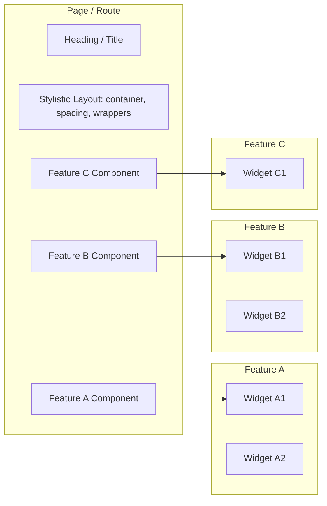

These rules apply regardless of whether you’re using **Next.js** or **TanStack Router / React Router**.

### Definition

Define page (or route) components directly in their respective route files.

### Composition

Pages should compose **at least one feature component** (or multiple, if needed).  
Pages are the place to bring **components from different features together** — that’s exactly their purpose.

### Stylistic Layout

Keep **headings, containers, spacing**, and other **purely stylistic layout elements** at the **page/route level**. These do not belong inside features.

### Page Heading

The heading of a page should always live in the page/route component, never inside a feature.

### Features

Features should only provide **functional, reusable building blocks** (components, hooks, queries, etc.).

Think of feature components as widgets or sections that can be plugged into different pages.

### Additional notes

The terms **page** and **route** mean the same thing — we usually say page in Next.js and route in React Router or TanStack Router.  

**File-based routing** is strongly preferred in both TanStack Router and React Router (just like in Next.js). It ensures consistent structure, discoverability, and reduces boilerplate.

## Visual Overview

